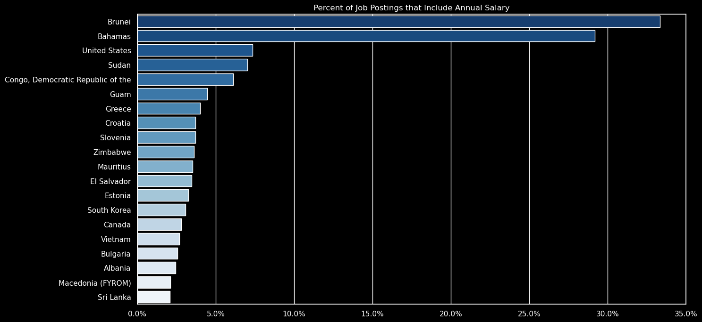

# What are the most optimal skills for a data nerd? 🤓
This project was built for my course, [ChatGPT for Data Analytics](https://www.lukebarousse.com/chatgpt), to uncover the most optimal skills to learn as a data nerd based on real-time data science job posting data.

**Data Source:** [datanerd.tech](https://www.datanerd.tech)

**AI Note:** This entire project was built using ChatGPT, from generating the code for visualizations to producing the text for this markdown file.

## Results
The most optimal skills were determined by developing a metric, termed "Skill Multiplier", that aggregates both the normalized demand and normalized salary of a given skill for a job title into a single metric.

### 🥇: Python and SQL
When analyzing the 3 most popular jobs in data science, Python and SQL stick out consistently as two of the most optimal skills. (Note: I also analyzed other titles in data science and they had similar trends)

**🔢 Data Analysts:** SQL is a must-have with a median salary of $92,500 and a significant presence in job postings. Python isn't far behind, proving essential in the data toolkit.

**💻 Data Engineers:** They benefit greatly from Python, with a median salary of $130,000. SQL also plays a pivotal role in this high-demand job title.

**🧪 Data Scientists:** Python leads the way with a median salary of $126,500, reflecting its critical role in data modeling and analysis. SQL remains a fundamental skill, underscoring the importance of data manipulation and retrieval.

### How this was calculated:

#### Normalized Value Formula

The normalized value for each skill within a job title is calculated as:

$$
\text{Normalized Value} = \frac{\text{Value} - \text{Min Value within Job Title}}{\text{Max Value within Job Title} - \text{Min Value within Job Title}}
$$

#### Skill Multiplier Formula

The skill multiplier, which combines the normalized skill count and normalized median salary, is calculated as:

$$
\text{Skill Multiplier} = \text{Normalized Skill Count} \times \text{Normalized Median Salary}
$$

## 👀 Exploratory Data Analysis
  
### Countries  

- The **USA holds the majority** of data job postings, a clear market leader.
- A noticeable presence in Europe and India, showcasing a **growing global demand**.
- South America and Africa show **emerging markets**, indicating potential growth areas.

The data job market is primarily concentrated in North America, with significant opportunities across Europe and Asia. 📡📈
  

### Job Posting Platforms

- **LinkedIn** is the colossus, with the **highest number** of job listings.
- **BeBee** and **Trabajo.org** show strong presence, possibly indicating niche or regional preferences.
- **Indeed** and **Recruit.net** are significant players, demonstrating their **global reach**.

LinkedIn’s dominance suggests it’s a critical platform for job seekers in the data field. 🌐💡
  

### Job Titles

- **Data Analyst** takes the lead, indicating a **high demand** for data processing skills.
- **Data Engineer** and **Data Scientist** follow, reflecting the industry's need for both infrastructure and analytics expertise.
- Senior roles like **Senior Data Engineer** and **Senior Data Scientist** suggest a market for experienced professionals.

The high numbers for foundational roles like Data Analyst and Engineer highlight their importance in the data ecosystem. 🌐🚀

## 🛠️ Skill Analysis

### Skills

- **SQL and Python dominate** as essential programming languages.
- Cloud services are crucial, with **AWS leading** the cloud skillset.
- **Visualization tools** like Tableau and Power BI are key player tools.
  
Programming prowess, cloud fluency, and visualization proficiency are the pillars of today's data field. 🌐🔍

### Skills vs Titles

- **SQL** is the top skill, crucial across Data Analyst, Data Engineer, and Data Scientist roles.
- **Python** shows strong demand, especially for Data Scientists, reflecting its versatility in data analysis and machine learning.
- **R** has a notable presence, particularly in data science positions, indicating its statistical analysis strength.
- **Tableau** and **Excel** showcase the need for data visualization and spreadsheet skills.
- **Power BI** is also featured, though less prominently, highlighting its role in business intelligence.

The data underscores the importance of a strong foundation in data querying and programming languages. 🖥️✨

## 💸 Salary Analysis

### Salary Distributions
- The histogram shows a **bimodal distribution** of yearly salaries, suggesting two common salary ranges or peaks (one for junior roles, another for senior roles)
- The first peak occurs below **$100,000**, indicating a large number of entry to mid-level positions.
- The second peak, between **$200,000** and **$300,000**, could represent senior or specialized data roles.
- There's a long tail extending towards higher salaries, though these cases are less frequent.

This visualization highlights the potential for high earnings in the data field, especially with advanced expertise or roles. 🚀💼

### Missing Salary Data
- A striking trend: the majority of countries show less than **10%** of job postings include an annual salary in a job postings.
- Outliers like Brunei and the Bahamas are rare, with Brunei's job postings revealing salary over **30%** of the time and the Bahamas above **25%**.
- The United States sits just above **5%**, but this still means around **95%** of job listings leave applicants guessing. 🤔💡

The data speaks volumes about the global opacity in salary information, with most job seekers left in the dark. 📉🌐

### Median Salaries for Jobs

- **Senior Data Engineer** leads the pack with a median annual salary well above **$14
0,000**.
- **Senior Data Scientist** isn't far behind, marking a high value on seniority in data roles.
- Interesting to note, a **Data Analyst** position shows a noticeably lower median salary compared to engineering roles.
- **Cloud Engineer** closes the list, hinting at a competitive but slightly lower earning bracket within the tech field.

This bar chart illustrates the premium placed on senior roles and specialized engineering skills in the data job market. 🔝👩‍💻

### Median Salaries for Skills

- **Spark** and **Java** are at the top, commanding salaries near the **$140,000** mark.
- **Snowflake** skills also yield a high median salary, despite fewer job postings (3382).
- **SQL** is a common skill with over **16244 postings**, yet the median salary doesn't top the chart.
- **Excel** shows the lowest median salary, aligning with its position as a foundational, rather than a specialized, skill.

The bar chart clearly aligns high median salaries with specialized tech skills, showing the market's demand for advanced competencies. 🚀📈

## 🔝📊 Final Results: Optimal Skills for Data Roles 

### Programming Languages 🧠💻
- **Python**: Dominates as a high-impact skill across nearly all data-centric roles.
- **SQL**: Consistently important, essential for data manipulation and querying.
- **Java**: More significant for **Software Engineering** roles; less so for pure data positions.
- **Scala**: Valuable in Big Data environments, especially for roles involving **Spark**.

### Cloud Technologies ☁️🌐
- **AWS**: A top skill for **Senior Data Engineers**, reflecting the cloud's dominance in the industry.
- **Azure**: Important for **Software Engineers** and **Cloud Engineers**, showing a trend towards multi-cloud expertise.
- **Snowflake**: Notable for data roles, aligning with the rise of cloud data platforms.

### Visualization Tools 📊✨
- **Tableau**: A key skill for **Data Scientists** and **Senior Data Analysts**, indicating the importance of data storytelling and business intelligence.
- **Power BI**: More specific to **Senior Data Analysts**, suggesting a niche for business-focused analysis within certain sectors.

### Spreadsheet and Data Processing 📑🔢
- **Excel**: Still relevant, especially for **Business Analysts**, signifying that traditional spreadsheet skills retain their value in the job market.
- **Pandas**: Mentioned for **Data Scientists**, underlining Python's ecosystem for data manipulation as a critical skill.

Overall, the trend suggests a high value placed on versatile programming skills, proficiency in major cloud services, ability to use advanced visualization tools for insights, and a blend of traditional and modern data processing abilities. Each role requires a unique combination of these skills to meet industry demands and maximize salary potential. 🌟📋

Data Source: [datanerd.tech](https://www.datanerd.tech)